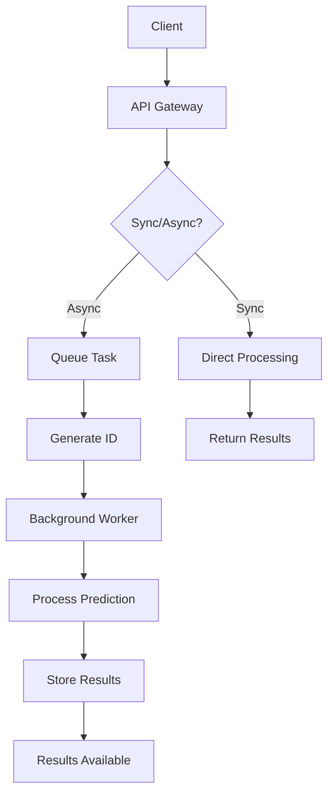

# PredictFlow Hub 🚀


A robust, scalable ML prediction service featuring both synchronous and asynchronous processing capabilities. Built with FastAPI and modern architectural patterns.

## 🌟 Key Features

- **Dual Processing Modes**
  - Synchronous predictions for immediate results
  - Asynchronous processing for long-running predictions
- **Queue Management System**
  - Background task processing
  - Job status tracking
  - Result persistence
- **RESTful API Endpoints**
  - Health checks
  - Prediction submission
  - Result retrieval
- **Docker Support**
  - Containerized deployment
  - Easy scaling
  - Consistent environments

## 🏗️ Architecture



## 🛠️ Technical Stack

- **Backend Framework**: FastAPI
- **Server**: Uvicorn
- **Queue System**: Custom Implementation
- **Containerization**: Docker & Docker Compose
- **Development Tools**: VS Code

## 📁 Project Structure

```
PredictFlow Hub/
├── app/
│   ├── api/         # API endpoints
│   ├── services/    # Business logic & ML services
│   └── schema/      # Data models & validation
├── .vscode/         # Editor configuration
├── dockerfile       # Docker image definition
├── docker-compose.yml
└── requirements.txt
```

## 🚀 Getting Started

### Prerequisites

- Python 3.10.1+
- Docker Desktop
- Git

### Quick Start

1. **Clone the Repository**
   ```bash
   git clone https://github.com/AmnaMubarak/PredictFlow-Hub.git
   cd PredictFlow-Hub
   ```

2. **Local Development Setup**
   ```bash
   python -m venv env
   source env/bin/activate  # On Windows: .\env\Scripts\activate
   pip install -r requirements.txt
   ```

3. **Docker Deployment**
   ```bash
   docker-compose up --build
   ```

## 🔌 API Endpoints

### Prediction Endpoints

- **POST** `/predictions/predict`
  - Submit new prediction request
  - Returns prediction ID for async mode

- **GET** `/predictions/predict/{prediction_id}`
  - Retrieve prediction results
  - Check prediction status

### Health Check

- **GET** `/`
  - Application health status
  - Service availability check

## 💡 Usage Examples

```python
# Synchronous Prediction
response = requests.post(
    "http://localhost:8000/predictions/predict",
    json={"data": input_data, "mode": "sync"}
)

# Asynchronous Prediction
async_response = requests.post(
    "http://localhost:8000/predictions/predict",
    json={"data": input_data, "mode": "async"}
)
prediction_id = async_response.json()["prediction_id"]

# Check Results
results = requests.get(
    f"http://localhost:8000/predictions/predict/{prediction_id}"
)
```

## 🔧 Configuration

Environment variables can be configured in `.env`:
```
MODEL_PROCESSING_TIME=10
ASYNC_MODE_ENABLED=true
```

## 👤 Author

**Amna Mubarak**
- GitHub: [@AmnaMubarak](https://github.com/AmnaMubarak)

## 📝 License

This project is licensed under the MIT License - see the [LICENSE](LICENSE) file for details.

## 🤝 Contributing

Contributions, issues, and feature requests are welcome! Feel free to check the [issues page](https://github.com/AmnaMubarak/PredictFlow-Hub/issues).

